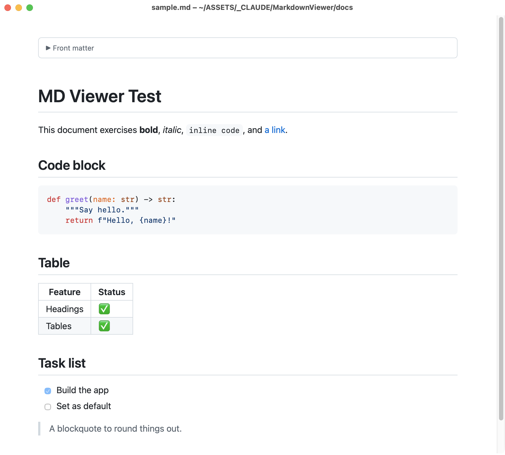

# MD Viewer

A tiny native macOS Markdown viewer. Double-click a `.md` file and it opens instantly with clean, GitHub-style formatting.

A lightweight native Markdown reader with an optional plain-text editor and live preview.



## Why another one?

Most Markdown viewers are Electron apps (100+ MB, slow to launch) or closed-source. MD Viewer is:

- **One Objective-C file** — the entire app is [`main.m`](main.m), readable in five minutes
- **Native** — AppKit + WKWebView, launches instantly, ~100 KB binary
- **Fully offline** — the rendering libraries are bundled; no network access, no telemetry, no accounts. Your files never leave your machine.
- **Free and MIT-licensed**

## Features

- GitHub-style rendering: headings, tables, task lists, blockquotes, images, footnote-style links
- Syntax highlighting for fenced code blocks (via highlight.js)
- Automatic dark/light mode following the system theme
- **Live reload** — edits to the file on disk re-render automatically, preserving scroll position
- YAML front matter shown as a collapsible block instead of raw text
- Links: web links open in your browser; links to other `.md` files open in a new viewer window
- Zoom (⌘+ / ⌘− / ⌘0), reload (⌘R), open dialog (⌘O), tabbed windows

## Install

Requires macOS 12+ and the Xcode Command Line Tools (`xcode-select --install`).

```sh
git clone https://github.com/DeanAhlgren/md-viewer.git
cd md-viewer
./build.sh
```

This compiles the app and installs it to `~/Applications/MD Viewer.app`.

### Make it the default for .md files

Right-click any `.md` file → **Get Info** → **Open With** → choose MD Viewer → **Change All…**

## How it works

`main.m` hosts a WKWebView per document window. The Markdown is parsed in the web view by a bundled copy of [marked.js](https://github.com/markedjs/marked), styled with a small hand-written GitHub-flavored stylesheet ([`Resources/template.html`](Resources/template.html)), and code blocks are highlighted by a bundled [highlight.js](https://github.com/highlightjs/highlight.js). Images referenced by the document are served through a custom `WKURLSchemeHandler`, and a GCD vnode source watches the file for changes to power live reload.

## License

MIT — see [LICENSE](LICENSE).

Bundled third-party libraries (both permissively licensed, see [THIRD-PARTY-LICENSES.md](THIRD-PARTY-LICENSES.md)):

- [marked.js](https://github.com/markedjs/marked) — MIT
- [highlight.js](https://github.com/highlightjs/highlight.js) — BSD-3-Clause

## Editing (v1.1)

Click **Edit** (⌘E) to edit Markdown in the same window. Toggle **Preview** to show or hide the live rendered view. Click **Save** or press ⌘S to save the original file, then **Done** to return to reading. Find (⌘F), undo/redo, cut, copy, and paste use the native macOS text editor. Smart quotes, smart dashes, and automatic text replacement are disabled.

Unsaved changes are marked in the window and prompt on Done, Close, and Quit. Saves use atomic replacement and check the on-disk content first. If the file has changed externally or disappeared, your draft remains open; **Save a Copy…** preserves it without replacing the original. Saving a copy does not mark the original draft as saved. Existing text and original UTF-8/Latin-1 encoding are preserved; unsupported characters in Latin-1 prompt an error instead of losing text (Save a Copy writes UTF-8).

**File → Open in Other Editor…** lets you choose another Mac app. External file changes continue to refresh automatically.

Build with `./build.sh`. Set `MDVIEWER_APP_PATH` to build at another location. Installation retains the previous bundle as a timestamped backup. Quit and reopen MD Viewer after updating.

Run `./tests/run.sh` from a logged-in macOS desktop session to check editing, native undo, preview rendering, file conflicts, encoding, and saving against temporary files.
